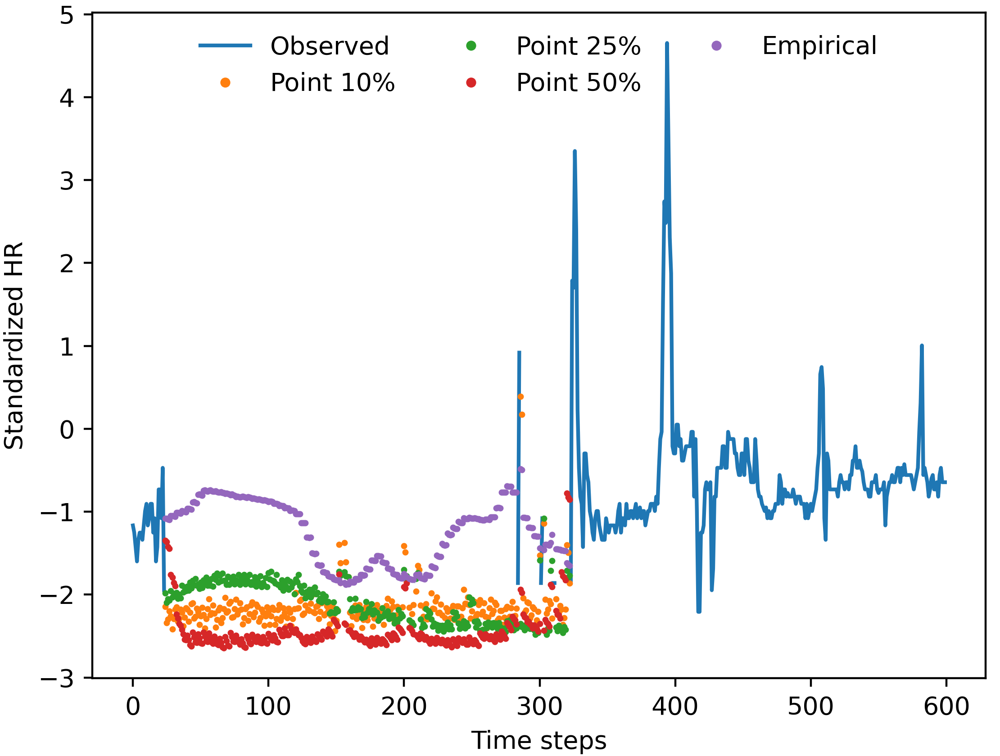

# TSI-WearableDevices
This repository will contain the code for a research project (in development) about masking policies for transformer-based imputation of missing values in wearable device records.

The figure below shows a selected segment of heart rate measurements with observed and imputed values for the same model architecture trained under different masking policies.

  

